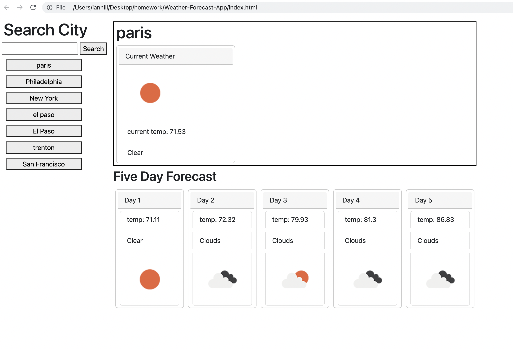

# Weather Forecast App

A simple weather forecast app

This app allows users to search weather by city. They are presented with current weather conditions and a 5-day forecast. The app saves recent searches to local storage and displays search history as buttons for easy access to frequent/past searches. 

The API that is used is Open Weather's One Call API 1.0

[Weather Forecast App link:](https://ianahill.github.io/Weather-Forecast-App/)